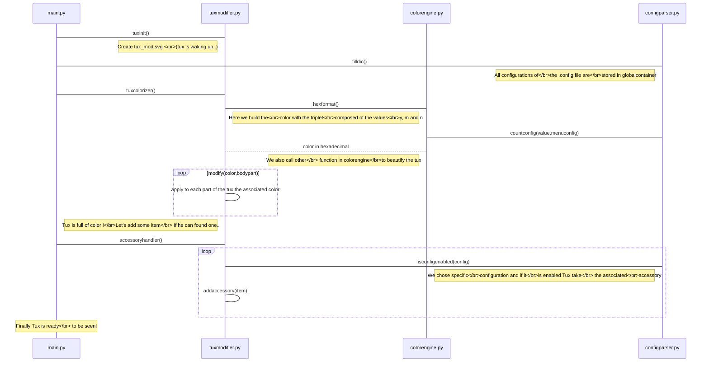

```mermaid
sequenceDiagram
participant main.py
participant tuxmodifier.py
participant colorengine.py
participant configparser.py

main.py->tuxmodifier.py: tuxinit()
Note left of tuxmodifier.py: Create tux_mod.svg </br>(tux is waking up..)

main.py->configparser.py: filldic()
Note left of configparser.py: All configurations of</br>the .config file are</br>stored in globalcontainer

main.py->tuxmodifier.py: tuxcolorizer()
tuxmodifier.py->colorengine.py: hexformat()
Note left of colorengine.py: Here we build the</br>color with the triplet</br>composed of the values</br>y, m and n
colorengine.py->configparser.py: countconfig(value,menuconfig)
colorengine.py-->tuxmodifier.py: color in hexadecimal
Note left of colorengine.py: We also call other</br> function in colorengine</br>to beautify the tux

loop modify(color,bodypart)
tuxmodifier.py->tuxmodifier.py: apply to each part of the tux the associated color
end
Note right of main.py: Tux is full of color !</br>Let's add some item</br> If he can found one..

main.py->tuxmodifier.py: accessoryhandler()
loop
tuxmodifier.py->configparser.py: isconfigenabled(config)
Note left of configparser.py: We chose specific</br>configuration and if it</br>is enabled Tux take</br> the associated</br>accessory
tuxmodifier.py->tuxmodifier.py: addaccessory(item)
end
Note over main.py: Finally Tux is ready</br> to be seen!
```
