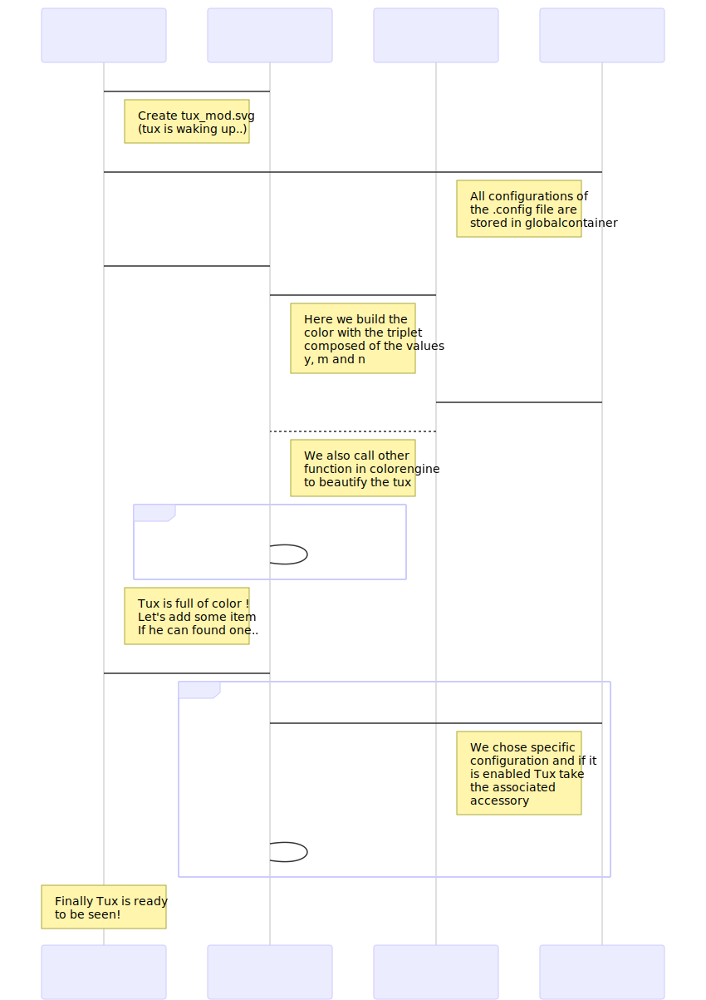

### The relation between Tux and the configuration file
How does the configuration file visually affect the Tux?
We proceed two different modification on the tux.
- The coloration of the Tux:
We have associated different body part of the Tux to a key word in a dictionary fill with the .config file then we produce a triplet containing the number of options set to yes, module and no. We assume that triplet as a RGB color then we turn it in a hexadecimal color. Finally every body part is colored with its own color.
- The add of accessory:
We wanted the accessory to not be a common thing so we have associated specific configuration options to different accessory.. And if the options is enable then Tux have the accessory!

## The programm step by step

- First of all we need to create a new Tux without any changes yet with tuxmodifier.tuxinit() .
- Then we load all of the selected options from a menuconfig in a global variable **gc** (for globalcontainer) with configparser.filldic() . Now we have a dictionnary with *key=name of the menuconfig* and *value=list of options name and their values (y, m or n)*.
- Now the modifications begins.. Lets call tuxmodifier.tuxcolorizer()
 As said above we create an hexadecimal color with colorengine.hexformat(menuconfig). This function calls configparser.countconfig(value, menuconfig) with the value y, m and n and returns the hexadecimal color corresponding to the triplet (y, m, n).
 - Lets apply to each part of the tux the associated color with the function tuxmodifier.modify(color, bodypart) .
 - The last part is the call of tuxmodifier.accessoryhandler()
 We check if a configuration option is enable (its value set to yes or module) with configparser.isconfigenabled(configname) and if it return true we add an accessory with tuxmodifier.addaccesory(item)
 

- HOW TO ADD A NEW ACCESSORY

There are several instructions to follow to correctly add a new accessory in the tuxart project :

1) First of all, you need to use a software like Inkscape, that you can download from https://inkscape.org/release/inkscape-0.92.4/
2) Copy "tuxart/sources/sprays/original_tux.svg" somewhere on your computer.
NEVER EDIT DIRECTLY THE ORIGINAL_TUX.SVG, it is used everywhere in the project and should not be edited
3) Open your copy of the original_tux in Inkscape.
4) Add a new calc to your tux, it should be called "layer2".
  NB : to add a new calc, go in the "calc" tab, and press "create new calc"
5) Now, you can either create a new accessory using Inkscape, or copy/paste an existing svg on the tux.
  NB : unfortunately, our project doesn't support gradients in accessories, so you can only use simple colors, so you have to make sure your accessory doesn't use it.
6) Save your personal tux with his new accessory.
7) Using Inkscape, create a new svg file in the tuxart/sources/sprays folder, like "hat.svg" for example ("hat" being the name of your own accessory), and save it.
8) You can now close Inkscape, we won't need it anymore.
9) In a text editor, like Atom, open both your new accessory saved as a svg file, and your personal tux where you created the accessory.
10) In the tux file, find the <g> tag that has the id "layer2". It Should be at the very end of the document.
11) Replace the "layer2" id by the name of your accessory, it should be the same than your new svg file. For example, if you created the svg file "hat.svg", the new id should be "hat".
12) You now have to copy the whole <g> tag and his child. It means that you have to copy the <g> that has the new id ("hat" for example), the following tags included in the <g> tag (it should be <paths> tags and maybe some new <g> tags), AND the closing </g> tag.
13) In your new svg file, you should only have one <g> tag. Remove it entirely, and paste the one you copied from your personal tux.
14) Make sure that your <g> tag has his closing tag </g> and that the id of the <g> is the name of the svg file
15) After the closing tag </g>, add the line <g id="mark"/>
  NB: no spaces etc, copy/paste it as it is
16) You are finished, well done.

tuxart/sources/sprays/helmet is a very simple example check it if you have issues understanding the <g> tag you have to copy/paste, or to check the <g id="mark"/> tag that you have to paste at the end of the document.
