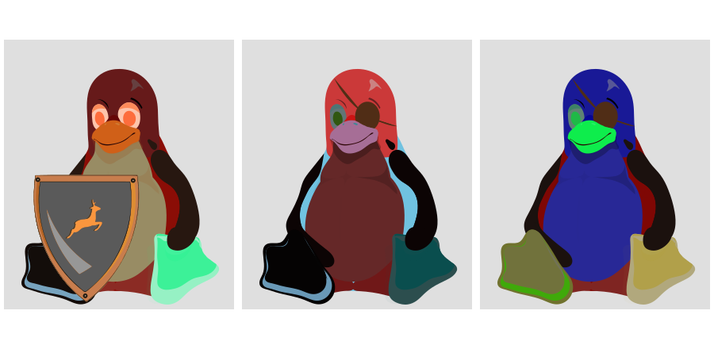

# WELCOME TO TUXART

## CONTEXT
The Linux kernel contains over 15000 configuration options, most of them take 3 different value (yes, no or module).
So theorically there are 3^15000 possible configuration files of the Linux kernel.
The **goal** of tuxart is to create as many different Tuxes as possible configuration files.

This program will fetch for your running Kernel's configuration file and then generate an unique Tux based on the current active configurations on your kernel.

The script will fetch in the default folders /boot and /proc for a configuration file.

An arbitrary kernel configuration file can be passed as argument, output file will be stored in ~/Pictures/CustomTux

## DOWNLOAD AND INSTALL INSTRUCTIONS:

- From terminal type
	- `wget "https://github.com/HommeOursPorc/tuxart/releases/download/3.2/tuxart-3.2.tar.gz"`
	- `pip3 install tuxart-3.2.tar.gz --user --install-option="--install-scripts=~/.local/bin"`
- Then add `~/.local/bin` to your command line with
	- `export PATH=$PATH:~/.local/bin`

### RUN TUXART

- From terminal type
	- `tuxart`

If you want to pass your custom configuration file:
- From terminal type
	- `tuxart -f [configuration file]`

Type `tuxart -h` or `tuxart --help` for help from terminal

## OPTIONS:

Various options are available if you already have a linux kernel.*

You can either :
- **generate a grid of Tux** (like the one in the header)
- **generate a .gif of Tux**

 - **summon elemenTux** ( all configurations set to yes, module or no )

 
 
 

### RUN OPTIONS

   - From terminal type :
	   - `tuxart --grid [path to kernel folder] [number of tux, default = 4]`
	   - `tuxart --gif [path to kernel folder] [number of tux, default = 4]`
	   - `tuxart --rgb [path to kernel folder]`

*If you don't have a kernel, download one from https://www.linux-mips.org/pub/linux/mips/kernel/v4.x/
Unpack the archive and run one of the command lines from above with the path to the archive's folder passed as argument.*

### The future of tuxart

While working with randomly generated kernels, a visual feedback can increase the comprehension of the latters.

Visual feedback can be improved by increasing choice between custom accessories. This kind of benefits can be achieved by adding more accessories and by fully respecting dependencies between related configurations.
